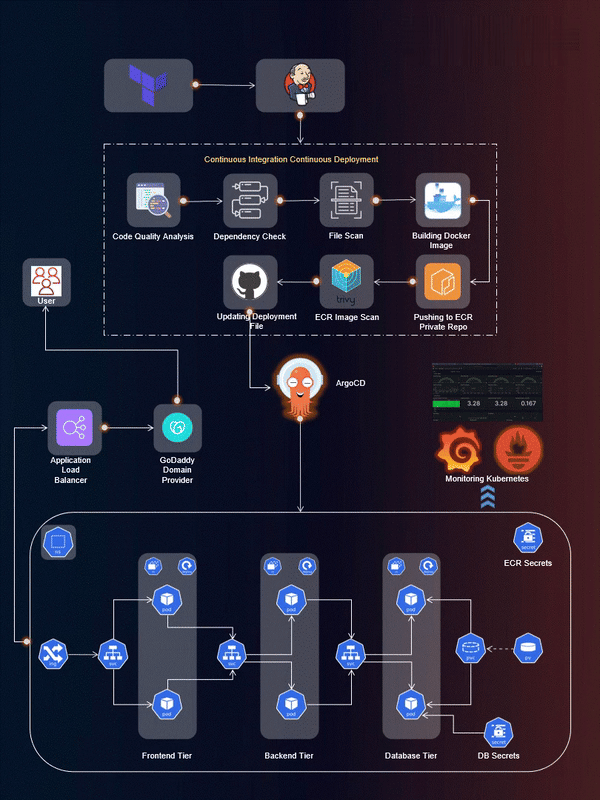

# 🚀 Three-Tier MERN Stack Web Application Deployment on AWS EKS using AWS EKS, Jenkins, ArgoCD, Prometheus and Grafana

# 🚀 Configuring Production-Ready EKS Clusters with Terraform

Welcome to the Three-Tier MERN Stack Web Application Deployment project! 🚀

This repository hosts the implementation of a Three-Tier Web App using ReactJS, NodeJS, and MongoDB, deployed on AWS EKS. The project covers a wide range of tools and practices for a robust and scalable DevOps setup.

## Table of Contents
- [Application Code](#application-code)
- [Jenkins Pipeline Code](#jenkins-pipeline-code)
- [Jenkins Server With Terraform](#jenkins-server-with-terraform)
- [Kubernetes Manifests Files](#kubernetes-manifests-files)
- [Project Details](#project-details)

## Application Code
The `app/` directory contains the source code for the Three-Tier Web Application. Dive into this directory to explore the frontend and backend implementations.

## Jenkins Pipeline Code
In the `jenkins/pipelines/` directory, you'll find Jenkins pipeline scripts. These scripts automate the CI/CD process, ensuring smooth integration and deployment of your application.

## Jenkins Server With Terraform
Explore the `tf/files/jenkins/` directory to find Terraform scripts for setting up the Jenkins Server on AWS and `tf/files/eks/` for eks with modules that demonstrates the practical steps to set up and automate an EKS cluster. These scripts simplify the infrastructure provisioning process.

## Kubernetes Manifests Files
The `k8s/manifests/` directory holds Kubernetes manifests for deploying your application on AWS EKS. Understand and customize these files to suit your project needs.

## Project Details
🛠️ **Tools Explored:**
- Terraform & AWS CLI for AWS infrastructure
- Jenkins, Sonarqube, Terraform, Kubectl, and more for CI/CD setup
- Helm, Prometheus, and Grafana for Monitoring
- ArgoCD for GitOps practices

🚢 **High-Level Overview:**
- IAM User setup & Terraform magic on AWS
- Jenkins deployment with AWS integration
- EKS Cluster creation & Load Balancer configuration
- Private ECR repositories for secure image management
- Helm charts for efficient monitoring setup
- GitOps with ArgoCD

📈 **The journey covered everything from setting up tools to deploying a Three-Tier app, ensuring data persistence, and implementing CI/CD pipelines.**

## Getting Started
To get started with this project, refer to our [comprehensive guide](https://ujwal5ghare.medium.com/end-to-end-three-tier-devsecops-project-bf719155ef33) that walks you through IAM user setup, infrastructure provisioning, CI/CD pipeline configuration, EKS cluster creation, and more.

## 🌟 Comprehensive Guide
For a detailed guide, please refer to my [blog post on Medium](https://ujwal5ghare.medium.com/end-to-end-three-tier-devsecops-project-bf719155ef33).

Happy Coding! 🚀
